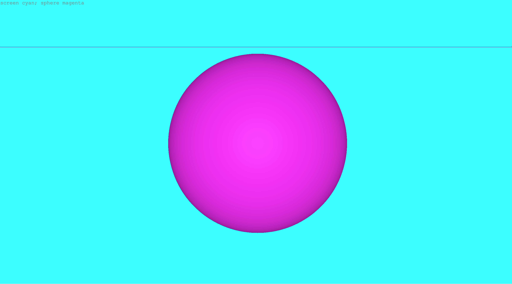

# Pulchra Docs

# How to use
Shortcuts (executed only when the text input field is on focus):
- Ctrl + Enter: Render 
- Ctrl + D: Open this doc in a new tab
(Unable to write? Try clicking Tab.) 
# Language
Code is written into the text field input and individual functions are always separated by semicolon.
Let's go!
## Screen
Background color or texture.
### Functions

- screen **scale** - grayscale (range from 0 - 1)
- screen rgb(**red**,**green**,**blue**) - RGB (all numbers range from 0 - 1)
- screen **name of color** - color from English name of the color 
- screen noise(**name of color**,**name of color**) - procedural texture made with Simplex noise used as the background texture
- screen tex("*insert URL here*") - whatever image/video from the Internet as the background texture

Examples:
```
screen 0.5
screen rgb(1,0.5,0)
screen yellow
screen noise(black,white)
```
## 3D shapes
Available shapes:
- circle
- cone
- cube
- cylinder
- sphere
- square
- torus
- torusKnot

Possible parameters (optional, in whatever order):
- radius (floating-point number from 0 - 1)
- color: 
  - rgb(**red**,**green**,**blue**)  (all numbers range from 0 - 1)
  - English color name
  - mat(*at least two color names separated by comma*) - randomly puts a color from the array into the mesh, e.g. mat(yellow,black,magenta)
  - noise(**name of color**,**name of color**) - procedural texture made with Simplex noise
- coordinates ([**x**,**y**] from -1 to 1)
- rotation (s
rot + X/Y/Z + (**speed** - can also be a negative number)), e.g. rotY(1),rotX(-2)
- tex("*insert URL here*") - whatever image or video from the Internet as a texture

Examples:
```
cube
sphere 0.5
cone 0.5 magenta
torus rgb(1,0.2,0.2) [0,1]
circle 0.3 magenta [-0.5,1] rotZ(1) 
sphere mat(red,green,yellow)
```
# Using texture sources from the Internet
- Perfect source of photos/videos is e.g. [Wikimedia Commons](https://commons.m.wikimedia.org/wiki/Main_Page)
- Copy the URL of the file (not the page where you see the file!)
- That's it! You can use the URL in the `tex()` function.